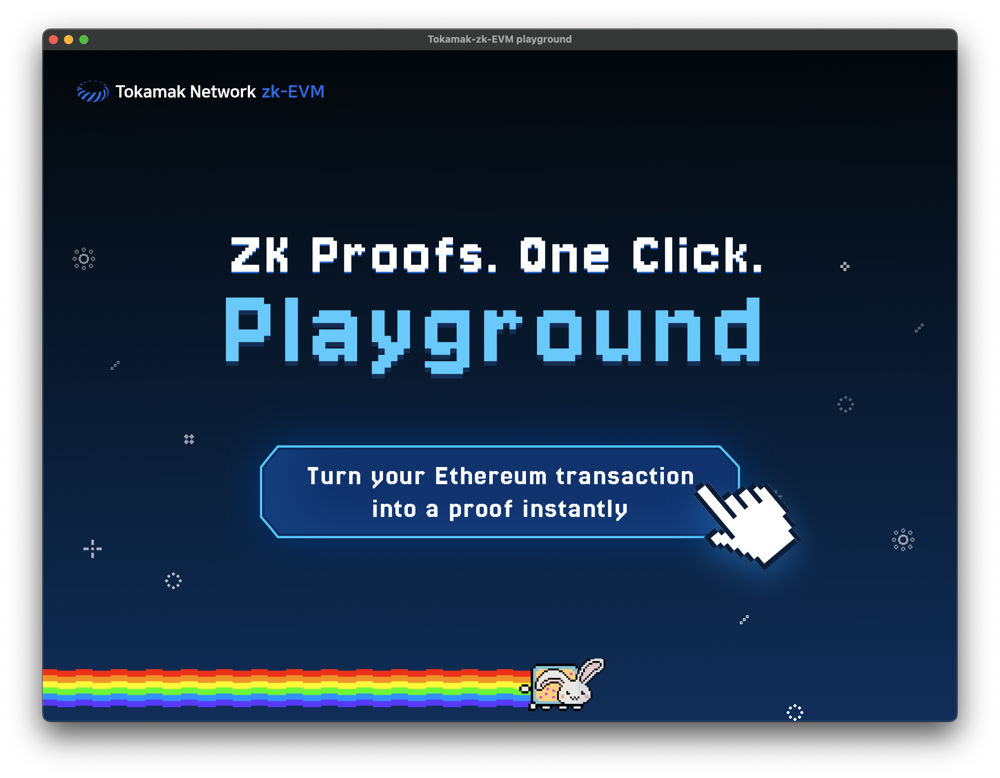
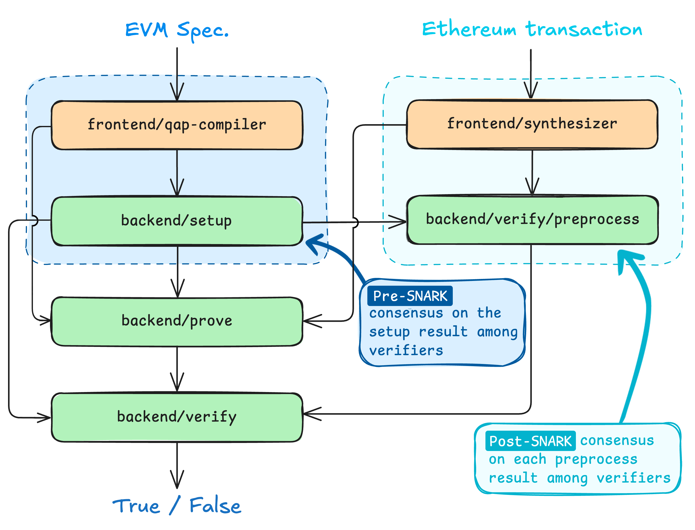

# Project Overview

_Last updated in Oct. 2025._

## TL;DR 

- Since 2022, [Tokamak Network](https://tokamak.network/#/) have been developing a new type of zk-EVM for layer-2 rollups.
- Despite the similar name, our zk-EVM takes a completely different technical approach compared to traditional zk-EVMs.
- Unlike traditional zk-EVMs, our zk-EVM is lightweight, affordable, and user-friendly.
- As “zk-EVM using SNARK assisted by interactive fraud proofs”, this project has been accepted by the **Ethereum Foundation** for Academic Grants Round 2023 of the Ecosystem Support Program (ESP).

## The story 

### The Demand 

Project Tokamak zk-EVM was born from the ecosystem and strategy of [Tokamak Network](https://www.tokamak.network/).

**(Tokamak ecosystem)** The Tokamak Network aims to support the Ethereum ecosystem by providing on-demand [layer 2 rollups](https://ethereum.org/en/developers/docs/scaling/#why-is-layer-2-needed). In other words, the Tokamak ecosystem exists as an extension and subset of the Ethereum ecosystem. Its goal is to let Ethereum users and infrastructure providers seamlessly migrate to Tokamak Network demand arises — and then return to Ethereum once that demand is fulfilled. This flexible model sets Tokamak Network apart from other layer 2 networks, which tend to maintain their own isolated, fixed ecosystems.

**(Tokamak strategy)** To define its strategy, the Tokamak Network has focuses on understanding which features Ethereum users value most. After careful thought, it concluded that _privacy_ and _trust-reliance_ are top priorities.

The core strength of (true) blockchains like Ethereum lies in guaranteeing security without relying on trust among network participants. However, this comes at the cost of slower transaction throughput, higher fees, and limited scalability. Layer 2 solutions are designed to offer Ethereum users better performance by partially shifting reliance from Ethereum’s trustless model to the trust assumptions on Layer 2 operators or third parties. In practice, this goal has been partially achieved: users often still need to trust the Layer 2 operator, and while performance has improved, the gains have sometimes fallen short of expectations depending on the application and design.

The Tokamak Network’s strategy is similar to other Layer 2 solutions, but differs in its details. While it accepts the trade-off of relying on trust in exchange for benefits, it redefines _who_ is trusted and _what_ those benefits are. In the Tokamak model, trust is placed in a small group of users who not only trust each other but also _operate their own the Layer 2_. The Tokamak Network believes that the key benefit for this group is _privacy —_ something Ethereum does not natively provide.

In short, Tokamak Network’s strategy is to prove on-demand Layer 2 solutions that empower users to run their own rollups in order to enhance privacy.

### The Supply 

Project Tokamak zk-EVM will serve as the foundation for a follow-up project, _Tokamak zk-rollup_. Together, they will meet the Tokamak Network’s goals and mark a major breakthrough in making zero-knowledge Layer 2 networks accessible, practical, and privacy-preserving. This system will show how _anyone_ can build and operate a ZKP-based rollup to improve their privacy — without needing technical expertise or specialized hardware.

**(Project Tokamak zk-EVM)** Tokamak zk-EVM consists of two core components: Frontend and Backend (see the end of this article for explanation of these concepts), fulfilling one of Tokamak Network’s central goals: “_Anyone can build, operate, and participate in a ZKP-based rollup._”

- The **Frontend**, powered by the Synthesizer, provides an intuitive graphical interface that allows even non-experts to convert Ethereum transaction or block validation logic into ZKP circuits. Users simply input a hash — no coding or knowledge of ZKPs is required. This simplicity will dramatically lower the technical barrier to building or operating a rollup.

<em>Playground GUI</em>

- The **Backend** features a lightweight prover that enables zk-proof generation on standard hardware. Unlike conventional systems that rely on high-performance or specialized machines, the Tokamak zk-EVM allows anyone to serve as a prover using an ordinary laptop.

**(Tokamak zk-Rollup)** Built on top of the Tokamak zk-EVM, the Tokamak zk-rollup is designed primarily to ensure privacy. While it also allows Layer 1 to verify Layer 2 activity, its core purpose is to obscure specific user actions in the process. This ensures that activity on Layer 2 remains private — even when verified by Layer 1.

In addition, Pre-SNARK and Post-SNARK consensus protocols are offered as optional mechanisms for low-trust environments — whether between Layer 1 and Layer 2, or among participants within Layer 2. These protocols help resolve disputes and establish consensus without relying on centralized authority.

## Into the Tokamak zk-EVM 

### Technical challenges in building a zk-EVM 

Project Tokamak zk-EVM addresses the problem of converting Ethereum block validation into ZKP proofs — a problem commonly tackled by what are known as zk-EVMs. Traditional zk-EVMs, however, are well known for being either difficult to use or expensive in terms of proof generation.

<em>Ethereum transaction/block validation with zk-EVM</em>

For example, Type-1 zk-EVMs, as defined by [Vitalik](https://vitalik.eth.limo/general/2022/08/04/zkevm.html) (e.g., Scroll), use a massive circuit that mimics the full EVM. These circuits pre-encode all the uncertainties involved in Ethereum block validation. While this approach avoids the need for preprocessing, the large circuit size leads to extremely high computational costs, requiring expensive and specialized hardware for proof generation.

Type-2 or higher zk-EVMs attempt to reduce this cost by using lighter circuits that simulate a smaller[ random-access machine](https://en.wikipedia.org/wiki/Random-access_machine) (RAM) instead of the full [EVM](https://ethereum.org/en/developers/docs/evm/) (EVM is also a large-scale RAM). However, these virtual machines cannot fully emulate real EVM programs (i.e., smart contracts). In addition, **compilers** are required to translate EVM programs into another language that is compatible with the smaller RAM.

The core issue here is **compiler integrity**: no technology today can formally guarantee that compiler outputs faithfully preserve the original program’s logic. As a result, these zk-EVMs must address this gap either by relying on trusted third parties or by reaching consensus among decentralized participants.

A concrete example is [SP1 by Succinct Network](https://docs.succinct.xyz/docs/sp1/introduction). To validate Ethereum blocks using SP1, you must write the Ethereum block validation logic in Rust. This code is compiled into a bytecode interpreted by RISC-V machine, which is a small-scale RAM used in SP1’s proof system. While SP1’s ZKP system can mathematically prove that the RISC-V bytecode executed correctly, it **does not** guarantee that the RISC-V bytecode itself is a faithful implementation of Ethereum’s block validation logic.

### Design Values 

Our design is guided by two core principles:

- Easy-to-use front-end compilers
- Lightweight back-end algorithms

### Solution 

We propose a new approach to ZKPs that emphasizes usability and efficiency, based on our fundamental research: [https://eprint.iacr.org/2024/507](https://eprint.iacr.org/2024/507).

As discussed in the _technical challenges_, one way to convert Ethereum block validation into ZK proofs is through the use of compilers. While we also use compilers, our approach differs significantly from that of traditional zk-EVMs. Specifically, we do **not** use a RAM-style circuit to handle all uncertainties — an approach that inevitably increases circuit size due to higher information entropy.

Instead, our circuits are block- or transaction-specific and are designed more like FPGA logic. As illustrated below, our process involves three stages:

1. [**qap-compiler**](https://github.com/tokamak-network/Tokamak-zk-EVM/tree/main/packages/frontend/qap-compiler) and [**setup**](https://github.com/tokamak-network/Tokamak-zk-EVM/tree/main/packages/backend/setup) define and commit to a library of modular, reusable subcircuits, each implementing essential operations for Ethereum block or transaction validation.
2. [**synthesizer**](https://github.com/tokamak-network/Tokamak-zk-EVM/tree/main/packages/frontend/synthesizer) preprocesses a given block or transaction to determine which subcircuits to use and how they should be connected.
3. [**prove and verify**](https://eprint.iacr.org/2024/507) combines the subcircuits into a final, purpose-built circuit ready for proof generation.

<em>The path from transaction/block to ZKP proof generation</em>

### Advantages 

This approach brings three key advantages:

- **Lightweight Circuits:** Because each circuit is optimized for a specific block or transaction, proof generation requires far less computational power and hardware resources.
- **Low Entropy Preprocessing:** Leveraging a predefined subcircuit library, the synthesizer produces low-entropy outputs, minimizing reliance on trust or communication overhead in consensus mechanisms.
- **Extremely Easy to Use:** Users simply input the hash of a transaction or block into [our graphical interface](https://github.com/tokamak-network/Tokamak-zk-EVM-playgrounds), and the compiler handles the rest — no coding required.

### Development Status (as of Oct. 2025)

- [**Zk-SNARK Theory**](https://eprint.iacr.org/2024/507)**:** Our theoretical framework for both front-end and back-end algorithms has been established, and their security has been formally analyzed.
- [**Pre-SNARK Consensus Theory**](https://eprint.iacr.org/2024/1671)**:** We have designed and analyzed a secure multi-party computation protocol for reaching consensus on the subcircuit library.
- [**Post-SNARK Consensus Theory**](https://eprint.iacr.org/2024/1664)**:** We have designed and analyzed a threshold consensus protocol to reach agreement on the integrity of synthesizer outputs.
- [**Front-End Compilers**](https://github.com/tokamak-network/Tokamak-zk-EVM/tree/main/packages/frontend)**:** Development and implementation have been published; the tools are now available for public testing.
- [**Back-End Algorithms**](https://github.com/tokamak-network/Tokamak-zk-EVM/tree/main/packages/backend)**:** Same as above.

## What’s Next? 

We envision a future where anyone can easily launch and operate their **own private Tokamak zk-rollup** at low cost using our ZKP technology. The strength of our work lies in making zero-knowledge proofs both easy to use and affordable. Our zk-EVM is a step toward realizing that vision. Inspired by Satoshi — for greater privacy.

## Few more details 

### Q: What do “Frontend” and “Backend” mean by in ZKP? 

The terminologies “Frontend” and “Backend” have been introduced by Justin Thaler in his book “[Proof, Arguments, and Zero-Knowledge](https://people.cs.georgetown.edu/jthaler/ProofsArgsAndZK.pdf)”.

The frontend refers to a set of compilers that translate general [NP-statements](<https://en.wikipedia.org/wiki/NP_(complexity)>), written in any programming language, into a format understandable by the ZKP backend — known as a circuit.

The backend is a set of protocol algorithms that allow a prover and a verifier to communicate and argue whether a given statement, expressed as a circuit, is true.

A ZKP system is the combination of both a frontend and a backend.

### **Q: Is Tokamak zk-rollup a private blockchain like Hyperledger?** 

**A:** No, Tokamak zk-rollup is not a private blockchain. It’s a layer 2 privacy solution built on top of Ethereum. Ethereum’s mainnet operates without requiring trust in any particular entity, whereas private blockchains rely on users trusting in a small group of authorized operators.

In Tokamak rollup, users themselves act as operators, and the system assumes partial (but not full) trust among them. Importantly, if trust among users breaks down and consensus fails, users can always safely return to the Ethereum mainnet without losing assets or security guaratnee.

In contrast, in a private blockchain, if the authorized operators collude or their trust is broken, ordinary users may have no choice but to suffer the consequences.

### **Q: Is Tokamak zk-rollup a state channel?** 

**A:** Tokamak zk-rollup shares characteristics with both [state channels](https://ethereum.org/en/developers/docs/scaling/state-channels/) and rollup networks. All of these are considered Layer 2 solutions but differ in purpose and design.

Features of state channels:

- Improve **scalability** by offloading transactions to Layer 2.
- Transactions are processed based on **mutual consensus** between users in the channel.
- Only the final state of the channel is submitted to Ethereum.
- Layer 2 transactions inside the channel **cannot** be re-verified by Ethereum, only the final settlement is accepted.
- The channel is **closed** after the final settlement is submitted to Ethereum.
- Typically, **only one DApp** operates within a state channel.

Features of rollup networks:

- Improve **scalability** by executing transactions on Layer 2.
- Transactions are processed based on **partial trust** in operators combined with either a [**verifiable computation**](https://en.wikipedia.org/wiki/Verifiable_computing) (e.g., zk-EVM) or a **consensus** (e.g., [fault proofs](https://docs.optimism.io/stack/fault-proofs)) between Ethereum and Layer 2.
- Periodically submit **batch commitments** of transactions to Ethereum.
- Ethereum can **partially verify** rollup transactions.
- The rollup network operates **semi-permanently**.
- **Multiple DApps** are supported on a single rollup network.

Features of Tokamak zk-rollup (Tentative)

- Improve **privacy** by utilizing Layer 2.
- Transactions are processed through a combination of **verifiable computation** + **mutual consensus**.
- Periodically submit **batch commitments** of transactions to Ethereum.
- Ethereum can **partially verify** rollup transactions.
- The channel can **continue** or be **dismantled** based on user demand.
- **Multiple DApps** are supported on a single channel (known as a [general state channel](https://dl.acm.org/doi/10.1145/3243734.3243856)).
