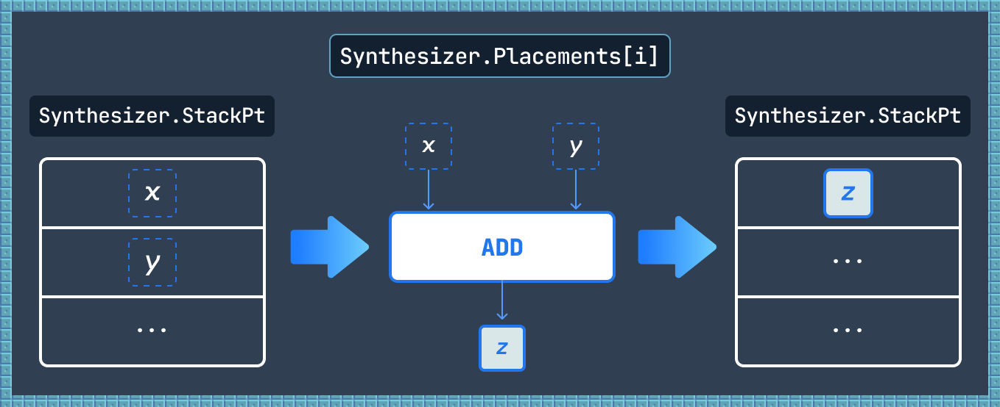

# Synthesizer: Code Examples

This document provides detailed code-level examples of how Synthesizer processes different types of EVM operations.

---

## Overview

Each example demonstrates:

- **Files involved**: Which source files participate in the operation
- **Code flow**: Step-by-step execution with actual code snippets
- **Key concepts**: Important implementation details

---

## 1. Arithmetic Operation (ADD)

This example shows how a simple ADD operation flows through the entire Synthesizer system.



### Files Involved

1. [`opcodes/functions.ts`](https://github.com/tokamak-network/Tokamak-zk-EVM/blob/main/packages/frontend/synthesizer/src/opcodes/functions.ts#L28-L33) - EVM handler
2. [`opcodes/synthesizer/handlers.ts`](https://github.com/tokamak-network/Tokamak-zk-EVM/blob/main/packages/frontend/synthesizer/src/opcodes/synthesizer/handlers.ts#L17-L26) - Synthesizer handler
3. [`core/handlers/operationHandler.ts`](https://github.com/tokamak-network/Tokamak-zk-EVM/blob/main/packages/frontend/synthesizer/src/tokamak/core/handlers/operationHandler.ts) - Placement creation
4. [`core/synthesizer/index.ts`](https://github.com/tokamak-network/Tokamak-zk-EVM/blob/main/packages/frontend/synthesizer/src/tokamak/core/synthesizer/index.ts) - Facade delegation
5. [`core/handlers/stateManager.ts`](https://github.com/tokamak-network/Tokamak-zk-EVM/blob/main/packages/frontend/synthesizer/src/tokamak/core/handlers/stateManager.ts) - State update

### Execution Flow

```typescript
// 1. EVM handler (opcodes/functions.ts:15-20)
[0x01, function (runState) {
  const [a, b] = runState.stack.popN(2);
  const r = (a + b) % TWO_POW256;
  runState.stack.push(r);
}]

// 2. Synthesizer handler (opcodes/synthesizer/handlers.ts:45-60)
[0x01, async function (runState) {
  const [a, b] = runState.stackPt.popN(2);
  const r = mod(a.value + b.value, TWO_POW256);
  synthesizerArith('ADD', [a.value, b.value], r, runState);
}]

// 3. synthesizerArith (opcodes/synthesizer/handlers.ts:15-40)
export const synthesizerArith = (
  op: ArithmeticOperator, ins: bigint[], out: bigint, runState: RunState
): void => {
  const inPts = runState.stackPt.popN(ins.length);
  const outPts = runState.synthesizer.placeArith(op, inPts);
  runState.stackPt.push(outPts[0]);
};

// 4. Synthesizer.placeArith (core/synthesizer/index.ts:60)
public placeArith(name: ArithmeticOperator, inPts: DataPt[]): DataPt[] {
  return this.operationHandler.placeArith(name, inPts);
}

// 5. OperationHandler.placeArith (core/handlers/operationHandler.ts:80)
public placeArith(name: ArithmeticOperator, inPts: DataPt[]): DataPt[] {
  // Map to subcircuit, create placement, return output symbol
}

// 6. StateManager records placement (core/handlers/stateManager.ts:48)
this.state.placements.set(this.state.getNextPlacementIndex(), placement);
```

### Key Concepts

- **Dual Execution**: EVM and [Synthesizer](synthesizer-terminology.md#synthesizer) handlers execute in parallel
- **[Symbol](synthesizer-terminology.md#symbol-processing) Tracking**: Input values become [DataPt](synthesizer-terminology.md#datapt-data-point) symbols
- **[Subcircuit](synthesizer-terminology.md#subcircuit) Mapping**: ADD operation maps to ALU1 subcircuit
- **[Placement](synthesizer-terminology.md#placement) Creation**: Each operation creates a circuit node

---

## 2. Storage Load (SLOAD)

This example demonstrates external data loading through buffer placements.

<figure><figcaption><p>SLOAD: Storage value → LOAD buffer → Symbol → StackPt</p></figcaption></figure>

<figure><figcaption><p>SSTORE: StackPt symbol → RETURN buffer → Storage value</p></figcaption></figure>

### Files Involved

1. [`opcodes/functions.ts`](https://github.com/tokamak-network/Tokamak-zk-EVM/blob/main/packages/frontend/synthesizer/src/opcodes/functions.ts#L1414-L1438) - SLOAD EVM handler
2. [`core/handlers/dataLoader.ts`](https://github.com/tokamak-network/Tokamak-zk-EVM/blob/main/packages/frontend/synthesizer/src/tokamak/core/handlers/dataLoader.ts#L86-L118) - loadStorage method
3. [`core/handlers/bufferManager.ts`](https://github.com/tokamak-network/Tokamak-zk-EVM/blob/main/packages/frontend/synthesizer/src/tokamak/core/handlers/bufferManager.ts) - addWireToInBuffer

### Execution Flow

```typescript
// 1. SLOAD handler (opcodes/functions.ts:54)
async function (runState) {
  const key = runState.stack.pop();
  const value = await runState.stateManager.getStorage(...);
  runState.stack.push(value);

  // Synthesizer part
  runState.stackPt.push(
    runState.synthesizer.loadStorage(
      runState.env.address.toString(),
      key,
      value
    )
  );
}

// 2. DataLoader.loadStorage (core/handlers/dataLoader.ts:45)
public loadStorage(codeAddress: string, key: bigint, value: bigint): DataPt {
  // Check cache
  if (this.state.storagePt.has(keyString)) {
    return this.state.storagePt.get(keyString)!;
  }

  // Load from PRV_IN buffer
  const inPt = DataPointFactory.create({ value, ... });
  const outPt = this.provider.addWireToInBuffer(inPt, PRV_IN_PLACEMENT_INDEX);

  // Cache
  this.state.storagePt.set(keyString, outPt);
  return outPt;
}

// 3. BufferManager.addWireToInBuffer (core/handlers/bufferManager.ts:30)
public addWireToInBuffer(inPt: DataPt, placementId: number): DataPt {
  // Create symbol from external value
  const outPt = DataPointFactory.create({
    source: placementId,
    wireIndex: nextIndex,
    value: inPt.value,
  });

  // Record in buffer placement
  this.state.placements.get(placementId)!.inPts.push(inPt);
  this.state.placements.get(placementId)!.outPts.push(outPt);

  return outPt;
}
```

### Key Concepts

- **[Buffer Placement](synthesizer-terminology.md#buffer-placements)**: [PRV_IN](synthesizer-terminology.md#prv-in-and-prv-out) buffer ([Placement](synthesizer-terminology.md#placement) 2) converts external values to [symbols](synthesizer-terminology.md#symbol-processing)
- **Caching**: Warm storage accesses reuse existing symbols
- **Symbol Creation**: External values become circuit-compatible [DataPt](synthesizer-terminology.md#datapt-data-point) symbols

---

## 3. Memory Load with Aliasing (MLOAD)

This example shows how Synthesizer handles overlapping memory writes.

<figure><figcaption><p>Data aliasing in memory: overlapping writes lose information in traditional EVM</p></figcaption></figure>

<figure><figcaption><p>MemoryPt tracks both space and time to resolve aliasing</p></figcaption></figure>

<figure><figcaption><p>MLOAD reproduces aliasing using SHR, SHL, AND, OR subcircuits</p></figcaption></figure>

### Files Involved

1. [`opcodes/functions.ts`](https://github.com/tokamak-network/Tokamak-zk-EVM/blob/main/packages/frontend/synthesizer/src/opcodes/functions.ts#L1277-L1286) - MLOAD EVM handler
2. [`pointers/memoryPt.ts`](https://github.com/tokamak-network/Tokamak-zk-EVM/blob/main/packages/frontend/synthesizer/src/tokamak/pointers/memoryPt.ts#L266-L284) - getDataAlias method
3. [`core/handlers/memoryManager.ts`](https://github.com/tokamak-network/Tokamak-zk-EVM/blob/main/packages/frontend/synthesizer/src/tokamak/core/handlers/memoryManager.ts) - placeMemoryToStack

### Execution Flow

```typescript
// 1. MLOAD handler
function (runState) {
  const pos = runState.stack.pop();
  const word = runState.memory.read(Number(pos), 32);
  runState.stack.push(bytesToBigInt(word));

  // Synthesizer part
  const posPt = runState.stackPt.pop();
  const dataAliasInfos = runState.memoryPt.getDataAlias(posPt.value, 32);
  const reconstructedPt = runState.synthesizer.placeMemoryToStack(dataAliasInfos);
  runState.stackPt.push(reconstructedPt);
}

// 2. MemoryPt.getDataAlias
public getDataAlias(offset: bigint, size: number): DataAliasInfos {
  // Find all overlapping memory writes
  const overlaps = this._viewMemoryConflict(offset, size);

  // For each overlap, calculate shift and mask
  return overlaps.map(entry => ({
    dataPt: entry.dataPt,
    shift: calculateShift(...),
    masker: generateMasker(...)
  }));
}

// 3. MemoryManager.placeMemoryToStack
public placeMemoryToStack(dataAliasInfos: DataAliasInfos): DataPt {
  // Generate reconstruction circuit
  // Uses SHR, AND, SHL, OR subcircuits
  // Returns final reconstructed symbol
}
```

### Key Concepts

- **[Memory Aliasing](synthesizer-terminology.md#data-aliasing)**: Tracks overlapping memory writes over time
- **Circuit Reconstruction**: Generates SHR, SHL, AND, OR [placements](synthesizer-terminology.md#placement) to combine fragments
- **2D Memory Model**: [MemoryPt](synthesizer-terminology.md#memorypt) uses (offset × time) to track all writes
