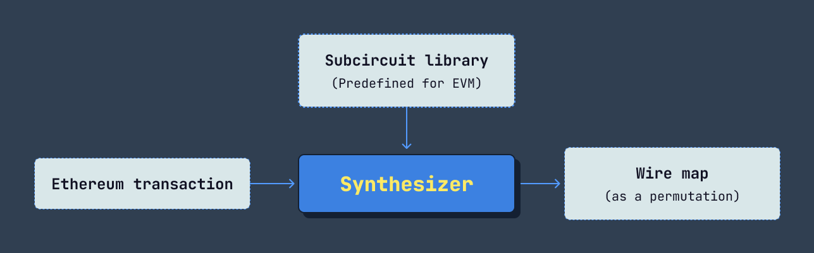
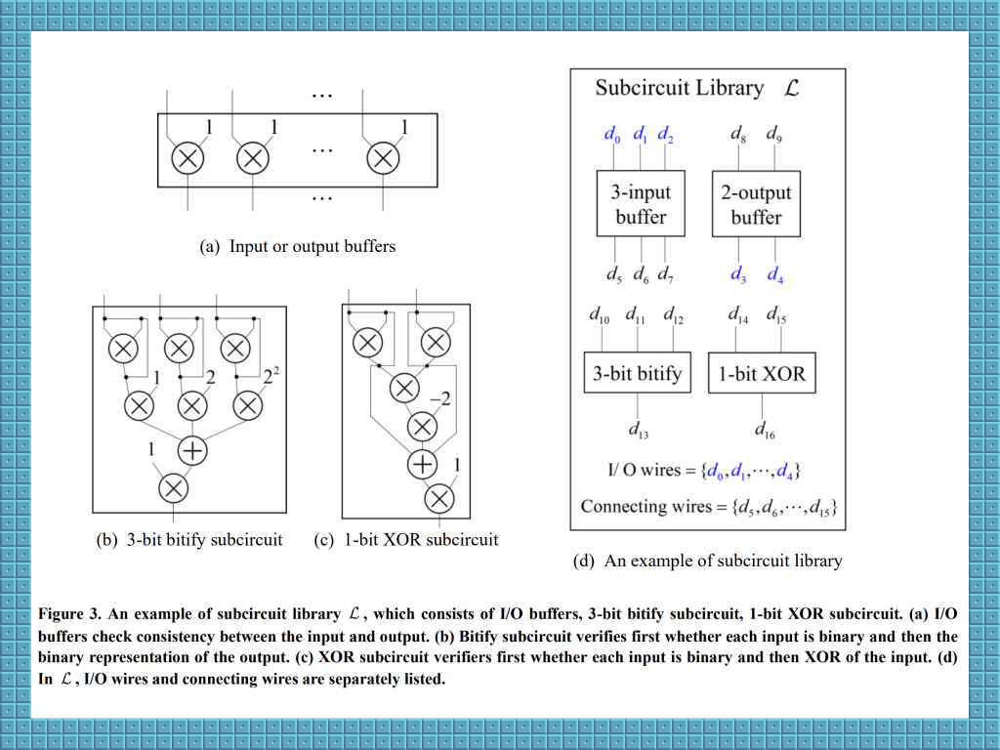
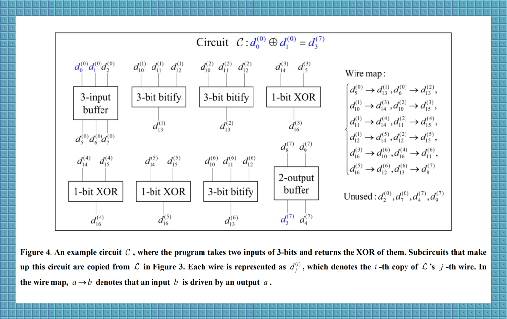
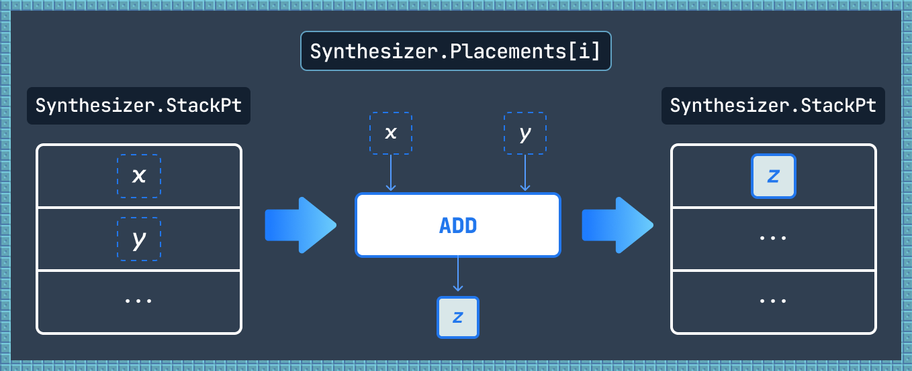

# Synthesizer: Concepts

### What is Synthesizer?

Synthesizer is a compiler that processes an Ethereum transaction and returns a _wire map._ This wire map serves as preprocessed input for [Tokamak zk-SNARK](https://eprint.iacr.org/2024/507).



<p align="center"><em>Input and output of Synthesizer</em></p>

The prover and verifier of Tokamak zk-SNARK require a zk circuit to initiate an argument. In general, zk circuits translate general programs into a ZKP-compatible language. In our context, Synthesizer translates Ethereum transactions into transaction-specific zk circuits (referred to simply as _circuits_).

Suppose [a predefined library of subcircuits](https://github.com/tokamak-network/Tokamak-zk-EVM/tree/main/packages/frontend/qap-compiler/subcircuits/library) is provided. A circuit is then constructed by placing copies of these subcircuits and connecting their input and output wires. The wire map generated by Synthesizer is in the form of a permutation map, describing the wire connections between these placements. A more rigorous definition of Synthesizer is provided in [the paper](https://eprint.iacr.org/2024/507).



<p align="center"><em>Figure from the paper</em></p>



<p align="center"><em>Figure from the paper</em></p>

We anticipate that the subcircuits in our prepared library are sufficient to represent all signal processing performed within the EVM, with the exception of the Keccak function. As a result, the resulting circuit—constructed as a combination of these subcircuits—is expected to handle all kinds of Ethereum transactions.

If we encounter an unexpected transaction that cannot be represented using our current library, new subcircuits can be added as needed by us or external contributors. For instance, this was the case with the EXP instruction, which will be explained later.

However, we have chosen not to implement a Keccak circuit due to efficiency concerns (see the section “[Arithmetic, comparison, and bitwise logic operations](https://www.notion.so/Synthesizer-documentation-164d96a400a3808db0f0f636e20fca24?pvs=21)” for further details).

### Where can I get the input?

- Ethereum transactions

You can retrieve Ethereum transactions from [Etherscan.io](http://etherscan.io). Simply copy a transaction’s hash and provide it to Synthesizer.

- Subcircuit library

We provide the [`qap-compiler`](https://github.com/tokamak-network/Tokamak-zk-EVM/tree/main/packages/frontend/qap-compiler) that manages a library of fundamental subcircuits. These subcircuits support EVM arithmetic and logical operations for 256-bit words. The subcircuits can be compiled into the R1CS format using [Circom](https://docs.circom.io/), making them compatible with Synthesizer. You don’t need to be familiar with Circom. Simply ensure that Circom is installed on your system and run the following shell script (be sure that you are in the folder "Tokamak-zk-EVM/packages/frontend/qap-compiler"):

```bash
./scripts/compile.sh
```

This script generates the files `subcircuit0.wasm` through `subcircuitN.wasm`, as well as `globalWireList.ts`, and `subcircuitInfo.ts`. These files are then used as input for the Synthesizer and the [bakcend algorithms](https://github.com/tokamak-network/Tokamak-zk-EVM/tree/main/packages/backend).

### Where does the output go?

Synthesizer behaves as a front-end compiler for Tokamak zk-EVM. The diagrams below illustrate the overall signal flow of Tokamak zk-SNARK:

<figure><figcaption><p>Front-end algorithms for Tokamak zk-SNARK</p></figcaption></figure>

<figure><figcaption><p>The back-end protocol of Tokamak zk-SNARK</p></figcaption></figure>

## Exploring Synthesizer’s core

Synthesizer works like an add-on to the EVM. In other words, Synthesizer performs additional tasks while still fulfilling the role of the EVM.

### Difference in signal processing from EVM

The difference in signal processing between the original EVM and Synthesizer are illustrated in the figures below.

<figure><figcaption><p>Signal processing in EVM</p></figcaption></figure>

In this figure, the EVM takes input values such as environment information, hardcoded data from a bytecode, block information, and data loaded from storage. It then returns output values, including data to be stored in storage, data for logs, and the amount of used gas. In EVM, the relationship between the inputs and outputs is not directly observable.

<figure><figcaption><p>Signal processing in Synthesizer</p></figcaption></figure>

As illustrated in this figure, the EVM with Synthesizer treats inputs as _symbols_ instead of direct values. Synthesizer produces an intermediate output called `Placements`, which lists subcircuit placements that manipulates the input symbols. These placements allow the output symbols to be _evaluated_ as EVM outputs. In simpler terms, `Placements` establish a traceable relationship between EVM outputs and inputs by composing subcircuits from the library. The remaining task for Synthesizer is to convert `Placements` into a permutation map.

Although Synthesizer treats inputs as symbols, it is important to note that this approach is unrelated to [symbolic execution](https://en.wikipedia.org/wiki/Symbolic_execution). When Synthesizer encounters a computation fork during transaction execution, it strictly follows the branch selected by the original EVM, disregarding other possibilities. As zk circuits generally exhibit passive and deterministic properties, the subcircuit composition in Synthesizer follows these principles.

As the EVM processes each instruction, Synthesizer performs additional work. Below, we break down how Synthesizer handles each group of [EVM instructions](https://www.evm.codes/).

### Conversion between symbols and evaluations

When Synthesizer starts, `Placements` is initialized with buffer subcircuit placements. Each buffer subcircuit can take multiple inputs and pass them to outputs. Buffers serve as interfaces for circuits to receive or output external values. They are also used as converters to translate EVM input values into symbols or symbols into EVM output values.

For instance, consider an EVM transaction that retrieves two input values—one from calldata and another from storage—and stores their product in storage. As the result of Synthesizer, the`Placements` would look like the figure below:

<figure><figcaption></figcaption></figure>

In this figure, `LOAD` and `RETURN` represent the buffer subcircuit placements to produce and evaluate the sybols $$x$$, $$y$$, $$z$$ respectively. The other placement, `MUL`, copied from the library subcircuit for the product, uses these symbols as its inputs and outputs. Here we provide an (simplified) example of the resulting `Placements`:

```json
Placements = {
  "0": {
    "name": "LOAD",
    "inPts": [
      {
        "source": "code: ${address}",
        "type": "Calldata(User)",
        "offset": 0,
        "valueHex": "0x02"
      },
      {
        "source": "storage: ${address}",
        "key": "0x00",
        "valueHex": "0x0a"
      }
    ],
    "outPts": [
      {
        "source": "placement: 0",
        "wireIndex": 0,
        "valueHex": "0x02"
      },
      {
        "source": "placement: 0",
        "wireIndex": 1,
        "valueHex": "0x0a"
      }
    ]
  },
  "1": {
    "name": "RETURN",
    "inPts": [
      {
        "source": "placement: 2",
        "wireIndex": 0,
        "valueHex": "0x14"
      }
    ],
    "outPts": [
      {
        "dest": "storage: ${address}",
        "key": "1",
        "valueHex": "0x14"
      }
    ]
  },
  "2": {
    "name": "MUL",
    "inPts": [
      {
        "source": "placement: 0",
        "wireIndex": 1,
        "valueHex": "0x0a"
      },
      {
        "source": "placement: 0",
        "wireIndex": 0,
        "valueHex": "0x02"
      }
    ],
    "outPts": [
      {
        "source": "placement: 2",
        "wireIndex": 0,
        "valueHex": "0x14"
      }
    ]
  }
}
```

In Synthesizer, all library's subcircuits other than buffers are strictly allowed to handle only symbols as both inputs and outputs. In other words, buffer subcircuits are the only placements that can directly take non-symbol values as inputs or outputs. Additionally, there can be only one buffer placement of a given purpose within `Placements`. For example, in the scenario above, there can be at most one `LOAD` and one `RETURN` in `Placements`.

### L2 State Management with Merkle Trees

For Layer 2 state channel implementations, Synthesizer employs a Merkle tree-based state management system to efficiently track and prove state transitions. This approach enables privacy-preserving, off-chain transactions that can be batched and verified on-chain.

#### State Transition Flow

The L2 state management follows a clear three-phase flow:

1. **Initial State**: A Merkle root representing the initial storage state is provided as a public input (`INI_MERKLE_ROOT`)
2. **Transaction Execution**: The Synthesizer processes the transaction while tracking all storage modifications
3. **Final State**: A new Merkle root is computed and provided as a public output (`RES_MERKLE_ROOT`)

This design allows verifiers to confirm that the state transition is valid without revealing the individual storage operations.

#### Merkle Tree Structure

The L2 implementation uses a **4-ary Merkle tree** with the following characteristics:

- **Arity**: 4 children per node (optimizes proof size vs. depth trade-off)
- **Depth**: 4 levels
- **Maximum Leaves**: 64 (4^4 = 256 theoretical, but limited to 64 for circuit efficiency)
- **Hash Function**: Poseidon (circuit-friendly, see "Poseidon Hash Function" section below)

Each leaf in the Merkle tree represents a storage slot and is computed as:

```
leaf = Poseidon(index, key, value, 0)
```

Where:
- `index`: The leaf's position in the tree (0-63)
- `key`: The storage key (hashed with Poseidon for L2)
- `value`: The storage value (255-bit word)
- `0`: Padding element

Internal nodes are computed by hashing their four children:

```
parent = Poseidon(child0, child1, child2, child3)
```

#### Registered Keys vs. General Storage

Synthesizer distinguishes between two types of storage access:

**Registered Keys** (User Storage):
- Pre-defined storage slots specified in `TokamakL2StateManagerOpts`
- Limited to 64 slots maximum
- Tracked in the Merkle tree
- Part of public inputs/outputs
- Enables privacy-preserving state proofs

**General Storage** (Contract Storage):
- Any other storage accessed during execution
- Not included in the Merkle tree
- Handled via `OTHER_CONTRACT_STORAGE_IN` and `OTHER_CONTRACT_STORAGE_OUT` buffers
- Recorded in the circuit but not part of the state commitment

#### Merkle Proof Verification

At the start of transaction processing (in the `_prepareSynthesizeTransaction()` method), Synthesizer prepares the initial state:

1. Load registered keys from L1 contract storage via RPC
2. Construct initial Merkle tree leaves
3. Compute initial Merkle root
4. Place `VerifyMerkleProof` subcircuit to validate `INI_MERKLE_ROOT` matches the computed root

At the end of transaction processing (in the `finalizeStorage()` method), Synthesizer finalizes the state:

1. Update Merkle tree leaves with new storage values
2. Recompute the Merkle tree from leaves to root
3. Output final Merkle root as `RES_MERKLE_ROOT`

The `VerifyMerkleProof` subcircuit ensures that the initial state is correctly committed, while the final root proves the validity of all state transitions.

**Reference**: See `synthesizer.ts:163-278` for the `finalizeStorage()` implementation.

### Stack, memory, storage, and flow operations

Similar to how the EVM manages the stack and memory, Synthesizer uses its own stack and memory structures, named `StackPt` and `MemoryPt`. Unlike the EVM’s stack and memory, which store values, `StackPt` and `MemoryPt` store symbols. These structures are synchronized with the EVM’s stack and memory. For instance, whenever an item is added to or removed from the stack, the same operation occurs in `StackPt`. The same applies to the relationship between `MemoryPt` and memory. The evaluation of each symbol in `StackPt` or `MemoryPt` corresponds to the value in the EVM’s stack or memory.

While both `StackPt` and the stack share a stack-like structure, `MemoryPt` and memory differ significantly. Memory is a one-dimensional structure, whereas `MemoryPt` is two-dimensional. When writing new data, the memory only considers the space where the data is written. In contrast, `MemoryPt` tracks both the space and time of the data write. This structural feature of `MemoryPt` allows Synthesizer to detect and track any manipulation of the symbols that occur during memory reads.

For example, suppose that there was data $$x$$ of length 0x20 at memory offset 0x10, and new data $$y$$ of length 0x20 is written at location 0x00. In the EVM, reading the memory region from 0x10 to 0x20 would lose information about $$x$$. However, `MemoryPt` allows us to track how $$x$$ and $$y$$ are manipulated and related to the read data, as illustrated below.

<figure><figcaption><p>Data aliasing in the memory</p></figcaption></figure>

<figure><figcaption><p>Data aliasing is solvable with MemoryPt</p></figcaption></figure>

#### Key instructions

- PUSHs: In the EVM, the PUSH instructions add hardcoded values from a bytecode to the stack. In Synthesizer, these value are symbolized (e.g., as $$x$$ through the `LOAD` buffer interface. The symbol is then added to the top of `StackPt`. The wires of `LOAD` used for the symbolization are recorded in `Placements`. \

  <figure><figcaption></figcaption></figure>

- MSTORE8: In the EVM, the MSTORE8 instruction writes only the last 8 bits of a stack item to the memory. In Synthesizer, this process is emulated by masking the symbol with a library subcircuit for the AND operation. The resulting symbol is added to `MemoryPt`. The `LOAD` wires for symbolizing a masker value and the new `AND` placement are recorded in `Placements`.
- MSTORE: In the EVM, the MSTORE instruction writes a stack item to memory. In Synthesizer, the MSTORE instruction adds a `StackPt` symbol to `MemoryPt`. No additional subcircuit placement is required.
- MSTORE8: In the EVM, the MSTORE8 instruction writes only the last 8 bits of a stack item to the memory. In Synthesizer, this process is emulated by masking the symbol with a library subcircuit for the AND operation. The resulting symbol is added to `MemoryPt`. The `LOAD` wires for symbolizing a masker value and the new `AND` placement are recorded in `Placements`.

  <figure><figcaption></figcaption></figure>

- MLOAD: In the EVM, the MLOAD instruction reads a specific memory region and adds the result to the stack. In Synthesizer, any possible aliasing of overwritten symbols in the memory region is reproduced using subcircuits (e.g., the library’s subcircuits for ADD, SHL, SHR, AND operations). The reproduced symbol is finally added to `StackPt`. All involved `LOAD` wires and new placements are recorded in `Placements`.

  <figure><figcaption></figcaption></figure>

- SSTORE: In the EVM, the SSTORE instruction moves a stack item to storage. We can regard this item as one of the actual EVM outputs. In Synthesizer, a `StackPt` symbol is fed to the interface buffer, `RETURN`, so that we can desymbolize or evaluate it. The wires of RETURN involved in the evaluation are recorded in `Placements`.\

  <figure><figcaption></figcaption></figure>

- SLOAD: In the EVM, the SLOAD instruction retrieves a storage value and adds it to the stack. In Synthesizer, this value is symbolized through `LOAD` and added to `StackPt`. The `LOAD` for the symbolization are recorded in `Placements`.

  <figure><figcaption></figcaption></figure>

- MCOPY: In the EVM, the MCOPY instruction copies a memory region of flexible size to another offset. In Synthesizer, truncation and shifting of symbols are reproduced before adding them to `MemoryPt`. All involved `LOAD` wires and new placements are recorded in `Placements`.

  <figure><figcaption><p>Reproduction of the newly added symbols</p></figcaption></figure>

- JUMP/JUMPI: Synthesizer performs no additional work beyond managing `StackPt.`

### Arithmetic, comparison, and bitwise logic operations

When the EVM interpreter executes instructions for arithmetic, comparison, or bitwise logic operations, it pops one to three operands from the stack, applies the operation, and then pushes the resulting value back onto the stack. Synthesizer follows the same process using `StackPt`. Additionally, Synthesizer records the relationship between input and output symbols in `Placements`.



<p align="center"><em>Signal processing in Synthesizer for arithmetic, comparison, and bitwise logic operations (e.g., ADD instruction).</em></p>

The placements that track symbol relationships resulting from these instructions are often directly represented using built-in subcircuits from the subcircuit library. However, for certain operations, such placements must be derived indirectly by combining multiple built-in subcircuits. Currently, Synthesizer derives placements for the EXP and KECCAK256 instructions indirectly. In the future, more instructions may be considered to adopt indirect placement derivation to further improve the efficiency of Tokamak zk-SNARK.

#### Instructions that need indirect placements

- EXP: Since the number of multiplications for a single exponentiation can only be determined when the input value is given, it is challenging to implement it as an optimized circuit. The output symbol manipulated by the EXP instruction can be reproduced using the placements shown in the figure below. This process utilizes two library subcircuits, `Bitify` and `SubEXP`.

  - `Bitify`: It has one input $$y$$, and $$k$$ outputs $$b_0,\cdots,b_{k-1}$$, such that $$y=\sum_{i=0}^{k-1}b_i2^i$$.
  - `SubEXP`: It has three inputs $$z_i,x_i,b_i$$, and two outputs $$z_{i+1},x_{i+1}$$, such that $$z_{i+1}=z_ix_i^{b_i}$$, $$x_{i+1}=x_i^2$$, and $$b_i\in\{0,1\}$$.

  <figure><figcaption><p>Reproduction of the newly added symbols</p></figcaption></figure>

- KECCAK256: Implementing Keccak hashing directly in a circuit is computationally inefficient. Both direct subcircuit implementation, such as [Keccak256-circom](https://github.com/vocdoni/keccak256-circom), and indirect derivation of placements would result in complexities of approximately 151k constraints. This is significantly higher compared to the complexity of thousands for the library subcircuits. Therefore, adopting a KECCAK256 subcircuit would severely impact the performance of the subsequent proving algorithm of the Tokamak zk-SNARK.

  As a result, Synthesizer does not reproduce the output symbols of KECCAK256. Instead, it uses buffer subcircuits to emit the KECCAK256 input values from the circuit and reintroduce the KECCAK256 output values back into the circuit. Outside the circuit, the Keccak hash computation can be run by the verifier of the Tokamak-zk SNARK.

  <figure><figcaption></figcaption></figure>

  In the EVM, the KECCAK256 instruction first loads a value from a specific memory region of variable length. This length can exceed the EVM’s word size of 32 bytes, and the value is then passed to the Keccak hash function. In Synthesizer, reproducing aliasing of symbols that during memory loading is handled similarly to the MLOAD instruction, with adjustments to account for the dynamic length of the memory region:

  - If the length of the memory region does not exceed 32 bytes, aliasing is reproduced in the same manner as described for MLOAD.
  - If the length of the memory region exceeds 32 bytes, Synthesizer divides the memory region into multiple 32-byte chunks and reproduces aliasing for each chunk individually.

  <figure><figcaption></figcaption></figure>

#### Poseidon Hash Function

For Layer 2 state channel implementations, Synthesizer supports the **Poseidon hash function** as a circuit-friendly alternative to Keccak256. Poseidon is specifically designed for zero-knowledge proof systems and offers dramatic efficiency improvements when used inside circuits.

**Performance Comparison**:
- **Poseidon**: ~150 constraints
- **Keccak256**: ~150,000 constraints (1000x more expensive)

This 1000-fold reduction in circuit complexity makes Poseidon the preferred choice for L2 state channels where all cryptographic operations must be proven inside the circuit.

**Usage in L2 Mode**:

In L2 state channel mode, Poseidon replaces Keccak256 for:
1. **Storage key hashing**: Computing storage slot addresses
2. **Merkle tree construction**: Hashing tree nodes (4 children → 1 parent)
3. **State commitments**: Creating compact state representations
4. **Address derivation**: Computing L2 addresses from public keys

The implementation uses a **4-input sponge construction** that iteratively folds variable-length inputs:

```
hash = Poseidon(input0, input1, input2, input3)
```

For inputs longer than 4 elements, the function recursively applies Poseidon until a single output remains.

**L1 vs. L2 Mode**:

Synthesizer supports both hash functions through the `getUserStorageKey()` method in `TokamakL2StateManager`:

- **L1 Mode** (`usage: 'L1'`): Uses Keccak256 for Ethereum mainnet compatibility
- **L2 Mode** (`usage: 'L2'`): Uses Poseidon for circuit efficiency

This dual-mode design allows the same codebase to handle both on-chain (L1) and off-chain (L2) transactions, with the hash function automatically selected based on the execution context.

**Custom Crypto Configuration**:

In L2 mode, Synthesizer configures the EthereumJS Common object to use Poseidon:

```typescript
const common = new Common({
  chain: Mainnet,
  customCrypto: { keccak256: poseidon } // Replace Keccak with Poseidon
})
```

This substitution is transparent to the EVM execution layer, allowing standard Ethereum transactions to be processed with L2-optimized cryptography.

**Reference**: See `TokamakL2JS/crypto/index.ts:11-56` for the Poseidon implementation and `TokamakL2StateManager.ts:160-188` for the dual-mode storage key calculation.

### System operations

Instructions in the system operations group manages EVM [contexts](https://www.evm.codes/about). These instructions enable the EVM to either enter a new child context or return to the existing parent context. Each context operates independently, in the perspective of managing its own stack and memory. Transferring memory data between parent and child contexts is exclusively handled by instructions in this group.

However, one context—whether parent or child—cannot directly manipulate the stack or memory of another context. When system operation instructions such as CALL or RETURN are executed, the EVM creates a virtual memory space (a buffer) to mediate these interactions. Each context can only access its own buffer. When a parent context initiates a child context, or when a child context terminates, a specified region of the memory from the current context is copied to the buffer. This buffer is then delivered as environmental information to the receiving context (child or parent).

In Synthesizer, `StackPt` and `MemoryPt` are maintained for each context, mirroring the behavior of the original EVM stack and memory. A virtual memory structure, similar to `MemoryPt`, is also implemented to facilitate memory data transfers between contexts. This identical structure enables Synthesizer to reproduce data aliasing that during memory transfers in the same way as with the MCOPY instruction.

To track symbol manipulations across all contexts, `Placements` is shared and jointly managed.

#### Key instructions

- CALL, CALLCODE, DELEGATECALL, STATICCALL (in a parent context): In the EVM, these instructions first copy a specific memory region from the parent context into a buffer. This buffer is then passed to the child context as environment information.

  In the Synthesizer, the data transfer from the memory to the buffer is handled in the same way as with the MCOPY instruction.

  <figure><figcaption></figcaption></figure>

- CALLDATALOAD, CALLDATACOPY (in a child context): In the child context, these instructions retrieve the buffer content. Any data aliasing during this process is reproduced in the same way as with the MLOAD or MCOPY instructions.

  <figure><figcaption></figcaption></figure>

- Any instruction execution (in a child context): All symbol manipulations are recorded in `Placements`, regardless of the context in which the EVM interpreter operators.
- RETURN (in a child context): In the EVM, this instruction transfers a specified memory region from the child context back to the parent context’s memory: The child context’s memory region of interest is first copied into a buffer, and when control returns to the parent context, the buffer content is written to a predefined memory region in the parent context.

  In Synthesizer, data aliasing during this composite transfer (from memory to buffer and then back to memory) is reproduced in the same way as with the MCOPY instruction.

  <figure><figcaption></figcaption></figure>

### Environmental and block information

The EVM uses instructions from the environmental and block information group to load an account’s state, the EVM interpreter’s state, and block information onto the stack. Most of the data loaded by these instructions can be treated as external inputs to the EVM, similar to storage data.

In Synthesizer, loading the external inputs to the EVM is handled in the same way as loading storage data. Specifically, when instructions in this group are executed, Synthesizer converts the external input values into symbols using the `LOAD` placement. For more details, refer to the explanation of SLOAD in the section “Stack, memory, storage, and flow operations”. Signal processing for each individual instruction in this group is omitted in this document.

#### Special cases: Child contexts

There are exceptions to this process, specifically for instructions like CALLDATALOAD, CALLDATACOPY, and RETURNCOPY when executed in child contexts:

- Main context: When these instructions are executed in the main context, the data loaded is treated as external inputs to the EVM, following the standard process similar to the case of SLOAD as described above.
- Child contexts: When executed in a child context, these instructions are processed as described in the section “System operations”, where they handle data transfer between contexts via buffers and produce aliasing if necessary.

### Log instructions

The EVM uses Log instructions to emit meaningful data manipulated during execution to external systems. This emitted data typically consists of memory data from a specific region, with optional stack data included as "topics". The data sent by Log instructions is treated as part of the EVM’s output, similar to storage data.

In Synthesizer, emitting the EVM output is handled similarly to emitting storage data. Specifically, when a Log instruction is executed, Synthesizer uses the `RETURN` placement to convert the symbols in `StackPt` or `MemoryPt` into values.

However, since some of these symbols are retrieved from specific memory regions, aliasing may occur during this process. In such cases, Synthesizer reproduces the aliasing using the same manner applied for the MLOAD instruction and records the process in `Placements`.

<figure><figcaption></figcaption></figure>

## L2 State Channel Transaction Signing

For Layer 2 state channel implementations, Synthesizer uses a completely different signature scheme compared to standard Ethereum transactions. Instead of ECDSA (Elliptic Curve Digital Signature Algorithm) used on Ethereum mainnet, L2 transactions employ **EdDSA (Edwards-curve Digital Signature Algorithm)** on the **JubJub curve**.

### Why EdDSA for L2 State Channels?

The choice of EdDSA over ECDSA is driven by circuit efficiency in zero-knowledge proof systems:

| Feature | EdDSA (JubJub) | ECDSA (secp256k1) |
|---------|----------------|-------------------|
| Circuit Constraints | ~10,000 | ~500,000 |
| Verification Cost | Low | Very High |
| Ethereum Compatible | No | Yes |
| Use Case | L2 state channels | L1 transactions |

The 50x reduction in verification constraints makes EdDSA the only practical choice for L2 state channels where signature verification must occur inside the circuit.

### JubJub Curve

JubJub is a **twisted Edwards curve** that is embedded in the BLS12-381 scalar field, making it ideal for integration with the Tokamak zk-SNARK proof system. The curve provides:

- **Base point** (`JUBJUB_BASE_X`, `JUBJUB_BASE_Y`): The generator for key generation
- **Point at infinity** (`JUBJUB_POI_X`, `JUBJUB_POI_Y`): The identity element
- **Field-native operations**: Efficient arithmetic inside BLS12-381 circuits

### TokamakL2Tx Transaction Structure

L2 transactions use the `TokamakL2Tx` class, which extends Ethereum's `LegacyTx` but reinterprets the signature fields:

**Standard Ethereum Transaction** (ECDSA):
- `v`: Recovery ID (27 or 28) + chain ID encoding
- `r`: ECDSA signature component (x-coordinate)
- `s`: ECDSA signature component

**TokamakL2 Transaction** (EdDSA):
- `v`: Always `27n` (indicates EdDSA mode, no recovery needed)
- `r`: EdDSA **randomizer point** R (serialized as bigint from Edwards point coordinates)
- `s`: EdDSA **signature scalar** s (JubJub field element)

This field reinterpretation allows L2 transactions to maintain compatibility with Ethereum transaction structures while using a completely different cryptographic scheme.

### Signature Generation Process

When signing an L2 transaction with `TokamakL2Tx.sign()`:

1. **Message Construction**: Combine transaction fields into a message array:
   ```
   message = [nonce, to, selector, input0, input1, ..., input8, pubkey]
   ```
   Each element is padded to 32 bytes and hashed with Poseidon.

2. **EdDSA Signing** (implemented in `eddsaSign_unsafe()`):
   - Generate nonce: `nonce_hash = Poseidon(DST_NONCE, privateKey, extraEntropy)`
   - Compute randomizer: `r = Poseidon(DST_NONCE, nonce_hash, pubkey, message) mod order`
   - Compute randomizer point: `R = r * G` (where G is the base point)
   - Compute challenge: `e = Poseidon(R_x, R_y, pubkey_x, pubkey_y, message) mod order`
   - Compute signature: `s = (r + e * privateKey) mod order`
   - Return: `(R, s)`

3. **Transaction Fields**:
   - Set `v = 27n`
   - Set `r = bytesToBigInt(R.toBytes())`
   - Set `s = signature scalar`

### Signature Verification

Signature verification in L2 transactions follows the EdDSA verification equation:

```
s * G = R + e * PublicKey
```

Where:
- `s`: Signature scalar (from transaction)
- `G`: JubJub base point
- `R`: Randomizer point (from transaction)
- `e`: Challenge hash `Poseidon(R, PublicKey, message)`
- `PublicKey`: Sender's public key

The `TokamakL2Tx.getSenderPublicKey()` method recovers and verifies the public key:

1. Extract message from transaction fields
2. Append the stored public key to the message
3. Call `getEddsaPublicKey()` which internally calls `eddsaVerify()`
4. Verify the stored public key matches the recovered key
5. Return the verified public key

**Note**: Unlike ECDSA where the public key is recovered from the signature, EdDSA requires the public key to be provided and verified. This is why `TokamakL2Tx` stores the sender's public key via `initSenderPubKey()`.

### Address Derivation

L2 addresses are derived differently from L1:

**L1 Address** (Ethereum):
```
address = keccak256(ecrecover_pubkey)[12:32]  // Last 20 bytes
```

**L2 Address** (Tokamak):
```
address = poseidon(pubkey_x, pubkey_y, 0, 0)[12:32]  // Last 20 bytes
```

The `fromEdwardsToAddress()` function converts an EdDSA public key (Edwards point) to an Ethereum-compatible 20-byte address using Poseidon hashing.

### Integration with Synthesizer

During transaction processing, Synthesizer handles EdDSA signature verification:

1. **Before Message** (`_prepareSynthesizeTransaction()`):
   - Extract function selector and inputs from transaction data
   - Recover sender address from EdDSA public key via `getOriginAddressPt()`
   - Cache the origin address for use during execution

2. **Circuit Integration**:
   - Public key components (`EDDSA_PUBLIC_KEY_X`, `EDDSA_PUBLIC_KEY_Y`) are public inputs
   - Signature scalar (`EDDSA_SIGNATURE`) and randomizer (`EDDSA_RANDOMIZER_X/Y`) are private inputs
   - The backend prover generates placements for signature verification subcircuits

This design enables privacy-preserving L2 transactions where signature validity is proven without revealing the signature itself to external observers.

**Reference**: See `TokamakL2Tx.ts:56-89` for `getSenderPublicKey()` implementation and `crypto/index.ts:85-136` for EdDSA signing/verification.

## Features not yet implemented

The following features or instructions are not currently supported in the existing version of Synthesizer. They will be implemented in the future.

### Batch transaction execution

The infrastructure for batch transaction processing has been implemented but is not yet fully tested and enabled by default. Currently, Synthesizer processes single transactions in production mode.

**Current Status** (Alpha):
- Single transaction mode: ✅ Fully supported and tested
- Batch transaction infrastructure: ✅ Implemented, 🧪 Testing in progress
- Production use: Single transaction only

**Planned Functionality** (Future Release):

Batch transaction mode will enable multiple off-chain transactions to be processed sequentially and proven together in a single proof. This is essential for Layer 2 state channel implementations where:

1. **State Channel Opening**: Multiple setup transactions initialize the channel state
2. **Off-chain Operations**: Many micro-transactions occur without touching L1
3. **State Channel Closing**: Batch of final transactions settles the accumulated state on-chain

In batch mode, the Synthesizer will:
- Process transactions sequentially, maintaining state across executions
- Accumulate Merkle tree updates from all transactions
- Generate a single proof covering the entire batch
- Produce one initial Merkle root (before batch) and one final Merkle root (after batch)

This approach dramatically reduces on-chain verification costs by amortizing proof generation and verification across multiple transactions.

**Implementation Note**: The event-driven architecture (`beforeMessage`, `step`, `afterMessage`) supports batch processing, but additional testing and optimization are needed before production deployment.
